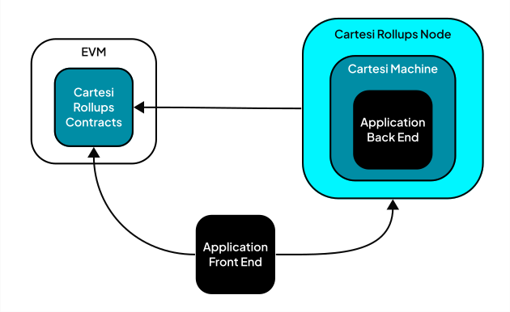
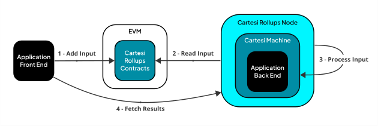
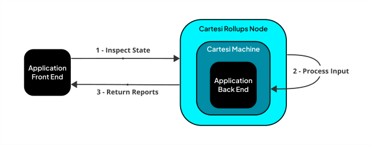
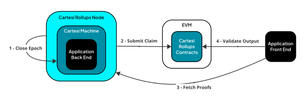

# Cartesi Rollups Node

This page assumes the reader knows the concepts of Cartesi Rollups.
The Cartesi Rollups [documentation page][rollups-docs] is an excellent place to learn these concepts.

[rollups-docs]: https://docs.cartesi.io/cartesi-rollups/overview/

## Introduction

The diagram above presents the topology of the Cartesi Rollups framework.
In this diagram, the white box is an EVM-compatible blockchain, such as Ethereum.
The blue boxes are the major Cartesi components in the Cartesi Rollups framework.
The black boxes are the components of the application built on top of Cartesi Rollups.

The Cartesi Rollups Contracts run in the base layer and are responsible for settlement, consensus, and data availability.
The Cartesi Machine is a deterministic execution environment that runs off-chain.
These two components live in completely decoupled environments, so the Cartesi Rollups framework needs another component to handle the communication between them.

The Cartesi Rollups Node is the middleware that connects the Rollups smart contracts, the application back-end running inside the Cartesi Machine, and the front-end.
As such, the Node reads the advance-state inputs from the smart contracts, sends those inputs to the Cartesi Machine, and stores the computation outputs in a database that the application front-end can later query.
The Node also provides a consensus mechanism so users can validate outputs on-chain.

## Features

This section delves into the Node features in more detail.

### Advance State

The diagram above presents the data flow for advancing the rollup state.
First, the application front-end adds an advance-state input to the `InputBox` smart contract in the base layer.
The Node watches the events emitted by this contract, reads the input, and sends it to the application back-end running inside the Cartesi Machine.
Once the application back-end processes the input, the Node obtains the outputs (vouchers, notices, and reports) and stores them in a database.
Finally, the application front-end reads these outputs from the database.

The Node provides a GraphQL API to read the rollup state for the application front end.
This API contains the advance-state inputs, the corresponding outputs, and the proofs necessary to validate the outputs on-chain.
The [`reader.graphql`](api/graphql/reader.graphql) file contains the schema for this API.

### Inspect State

Besides advance-state inputs, the Cartesi Machine can also process inspect-state inputs.
By definition, these inputs don't alter the machine's state; instead, they are a mechanism to query the application back-end directly.
The application front-end sends inspect-state inputs directly to the Rollups Node.
The Node sends the inputs to the Cartesi Machine, obtains the reports, and returns them to the application front-end (note the inspect-state inputs do not return vouchers and notices).

The Node provides a REST API for the application front-end to inspect the Cartesi Machine.
The [`inspect.yaml`](api/openapi/inspect.yaml) file contains the schema for this API.

It is worth noting that the current version of the Rollups Node can only process one input at a time, be it advance-state or inspect-state.
So, be cautious of using inspect-state inputs if your application has specific scalability requirements.
We recommend benchmarking the application back-end before committing to an architecture that relies on inspect-state inputs.

### Validate

The Rollups Node bundles multiple advance-state inputs into an epoch.
Since the Node only supports the Authority consensus mechanism, it is up to the Node to decide when it should close an epoch.
Once an epoch is closed, the Node computes a claim for the epoch and submits it to the rollups smart contracts.
Then, the application front-end fetches the proof that a given output is within the closed epoch and uses this proof to validate the output.
For instance, the front end may verify whether a notice is valid or execute a voucher.

Only the validator can submit a claim to the Rollups smart contracts.
The application developer decides who is the validator when deploying the application contract to the base layer.
If you want to run the Node but aren't the application's validator, you may turn off the feature that submits the claims.
The [configuration](#configuration) section describes how to do so.

### Host Mode

The host mode allows the developer to run the application back-end in the host machine instead of the Cartesi Machine.
This feature was deprecated in the Rollups Node 2.0 version; instead, developers should use [NoNodo][nonodo].

[nonodo]: https://github.com/gligneul/nonodo#nonodo

## Running

We recommend application developers use [Sunodo][sunodo-docs] to run the Node.
Advanced developers who want to modify the Node may check the [development](#development) section.

[sunodo-docs]: https://docs.sunodo.io/

### Configuration

The Rollups Node should be configured exclusively with environment variables, which are described at [Node Configuration](docs/config.md) page.

## Dependencies

The Cartesi Rollups Node depends on the following Cartesi components:

| Component | Version |
|---|---|
| Cartesi Machine SDK | [v0.17.1](https://github.com/cartesi/machine-emulator-sdk/releases/tag/v0.17.1) |
| Cartesi OpenAPI Interfaces | [v0.7.1](https://github.com/cartesi/openapi-interfaces/releases/tag/v0.7.1) |
| Cartesi Rollups Contracts | [v1.2.0](https://github.com/cartesi/rollups-contracts/releases/tag/v1.2.0) |
| Cartesi Server Manager | [v0.9.1](https://github.com/cartesi/server-manager/releases/tag/v0.9.1) |

## Development

Check the [development](docs/development.md) page for more information about developing the Rollups Node.

### Internal architecture

This document covered the features of the Node and its external APIs in a high-level manner.
Check the [architecture](docs/architecture.md) page for more details about the Node internal components.

## Contributing

Thank you for your interest in Cartesi!
Head over to our [Contributing Guidelines](docs/contributing.md) for instructions on how to sign our Contributors Agreement and get started with Cartesi!

Please note we have a [Code of Conduct](docs/code_of_conduct.md); please follow it in all your interactions with the project.

## License

Note: This component currently has dependencies licensed under the GNU GPL, version 3, so you should treat this component as a whole as being under the GPL version 3.
But all Cartesi-written code in this component is licensed under the Apache License, version 2, or a compatible permissive license, and can be used independently under the Apache v2 license.
After we rewrite this component, we will release it under the Apache v2 license.
