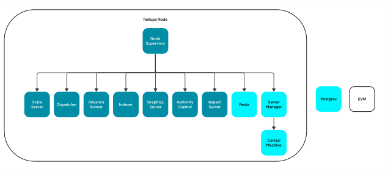
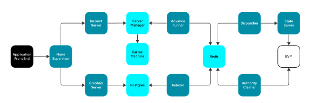

# Internal Architecture

This page describes the Rollups Node internal architecture.
Developers don't need to understand this architecture to develop applications for the Cartesi Rollups.
This documentation helps developers who want to modify the Rollups Node source code.

## Components

The Rollups Node depends on a few external components and several internal ones.
The external components are the Ethereum node and the PostgreSQL database.
The person who runs the Rollups Node should set up these external components and pass the corresponding configuration variables to the Node.

The diagram below presents the internal components of the Rollups Node.

### Rollups Node

The Rollups Node is a supervisor written in Go that manages the internal components.
The supervisor starts those components as subprocesses and ensures they behave correctly.
The internal components are several Rust microservices, Redis, the Server Manager, and the Cartesi Machine.

The Rollups Node is also an HTTP reverse proxy for the internal components.
It exposes the external HTTP endpoints and redirects the call to the corresponding component.

### State Server

The State Server listens and processes blockchain events.
It is a generic service that can listen to any event; it is up to the state-fold client to decide which events should be processed.
The Rust crate [`state-server`][state-server] and the [state-fold][state-fold] library contain the source code for this service.

[state-server]: ../offchain/state-server/
[state-fold]: https://github.com/cartesi/state-fold

### Dispatcher

The Dispatcher reads the inputs from the blockchain and publishes them to the Broker.
It uses the State Server to read the input events from the base layer.
The Dispatcher also decides when the epoch should be closed.
The Rust crate [`dispatcher`][dispatcher] contains the source code for this service.

[dispatcher]: ../offchain/dispatcher/

### Advance Runner

The Advance Runner is a proxy between the Server Manager and the Broker.
It reads advance-state inputs from the Broker, sends them to the Server Manager, and publishes the outputs, proofs, and claims to the Broker.
The Rust crate [`advance-runner`][advance-runner] contains the source code for this service.

[advance-runner]: ../offchain/advance-runner/

### Indexer

The Indexer reads the inputs, outputs, and proofs from the Broker and stores them in the Postgres database.
The Rust crate [`indexer`][indexer] contains the source code for this service.

[indexer]: ../offchain/indexer/

### GraphQL Server

The GraphQL Server implements the Rollups Node GraphQL API.
When it receives a query, the GraphQL Server reads the inputs, outputs, and proofs from the Postgres database.
The Rust crate [`graphql-server`][graphql-server] contains the source code for this service.

[graphql-server]: ../offchain/graphql-server/

### Authority Claimer

The Authority Claimer reads the claims from the Broker and submits them to the base layer.
The Rust crate [`authority-claimer`][authority-claimer] contains the source code for this service.

[authority-claimer]: ../offchain/authority-claimer/

### Inspect Server

The Inspect Server implements the inspect HTTP API and calls the Server Manager.
The Rust crate [`inspect-server`][inspect-server] contains the source code for this service.

[inspect-server]: ../offchain/inspect-server/

### Redis (Broker)

The Rollups Node uses [Redis Streams][redis-streams] as the message broker to handle communication between some of the internal components.
The Broker contains streams for inputs, outputs, proofs, and claims.
The Rust crate [`rollups-events`][rollups-events] contains the definition of these streams.

[redis-streams]: https://redis.io/docs/data-types/streams/
[rollups-events]: ../offchain/rollups-events/

### Server Manager

The Server Manager manages the Cartesi Machine.
It provides a high-level API to process advance-state and inspect-state inputs and computes the proofs to validate outputs.
The source code for the server-manager is on [another repository][server-manager-repo].

[server-manager-repo]: https://github.com/cartesi/server-manager

## Communication

The diagram above illustrates the communication between the Rollups Node components.
The following subsections explain how the data flows through the Node.

### Processing Advance-State Inputs

Using the State Server, the Dispatcher reads the inputs and publishes them to the inputs stream in the Broker.
The Advance Runner listens to the inputs stream; as it receives inputs, it sends them to the Server Manager.
The Server Manager sends the inputs to the Cartesi Machine and obtains the outputs.
The Advance Runner waits until the Server Manager finishes processing the input, obtains the outputs, and publishes them in the output streams in the Broker.
The Indexer listens to the input and output streams and stores these events in the Postgres database.

### Querying the Rollups State

The application front end may query the rollup state from the Node using the GraphQL API.
The Rollups Node receives the GraphQL request and forwards it to the GraphQL server.
The GraphQL server processes the request and fetches the data from the Postgres database.
Each call returns the fetched data in the response.

### Processing Inspect-State Inputs

The application front end sends an inspect-state request to the Rollups Node.
The Rollups Node forwards this request to the Inspect Server.
The Inspect Server translates this request from HTTP to gRPC, making another request to the Server Manager.
The Server Manager sends the inspect-state input to the Cartesi Machine and obtains the reports.
All the services return these reports as the response to the corresponding call.

### Submitting Claims

After the amount of time configured as the epoch size passes, the Node closes an epoch.
Note that the Node only closes an Epoch if there were advance-state inputs in this epoch.

When it is time to close an epoch, the Dispatcher publishes an event to the inputs stream in the Broker.
The Advance Runner listens to this event and asks the Server Manager to close the current epoch.
The Server Manager computes the output proofs and the epoch claim and returns them to the advance runner.
The Advance Runner publishes the proofs to the outputs streams and the claims to the claims streams on the Broker.

The Authority Claimer listens to the claims stream from the Broker and submits the claim to the Consensus smart contract in the base layer.

The Indexer listens to the outputs stream and stores the proofs in the Postgres database.
At this point, the application front end may query the GraphQL API to fetch these proofs.
