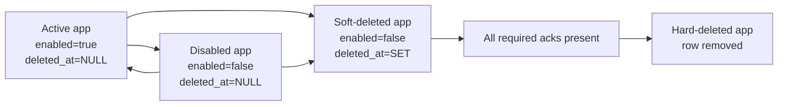
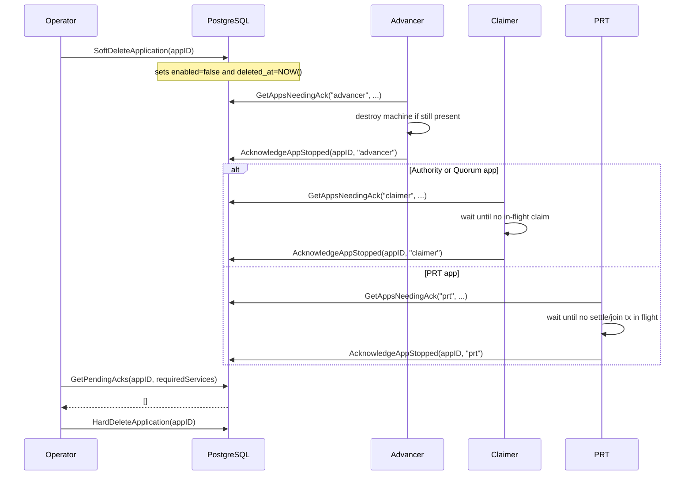

# Drain Protocol

The drain protocol coordinates safe application removal across the services that hold cross-tick state in the rollups-node.

Its purpose is narrow: when an application is being removed, the node must not hard-delete its database row while a stateful service still holds volatile resources for that app, such as:

- an Advancer machine process
- an in-flight Claimer L1 claim
- an in-flight PRT settle or join transaction

The protocol is database-driven. Services discover drain work by scanning PostgreSQL on each tick and writing durable acknowledgments when they are safe.

## Why It Exists

Hard-deleting an application while services still hold in-memory or in-flight state can destroy work and create inconsistent shutdown behavior. The drain protocol adds an explicit coordination step between:

- operator intent: remove this application
- service cleanup: release machines and finish or abandon in-flight work safely
- final deletion: permanently remove the application row and its dependent data

## Core Design

The protocol is built around three rules:

- the database is the source of truth for lifecycle and drain state
- drain starts on soft-delete, not on disable
- acknowledgments are durable rows, not volatile in-memory flags

This makes the protocol crash-restart safe. A restarted service does not need to remember what it was draining before the crash; it simply scans the database again on the next tick.

## Lifecycle Model

Enable/disable is operational. Soft-delete is irreversible and starts drain.



Important consequences:

- disabling an app does not itself create a drain obligation
- re-enable is allowed only while the app is not soft-deleted
- once `deleted_at` is set, the app is on the deletion path and cannot be re-enabled

## Participants

The protocol involves:

- PostgreSQL: stores lifecycle state and durable drain acks
- Operator/CLI: initiates remove and purge
- Advancer: must release machine state before acking
- Claimer: must clear in-flight claim tracking before acking
- PRT: must clear in-flight settle/join tracking before acking

Validator and EVM Reader are intentionally excluded. They do not hold cross-tick per-application state that needs drain coordination.

## Required Acks

Drain requirements are consensus-aware.

| Consensus Type | Required Services |
|---|---|
| Authority | `advancer`, `claimer` |
| Quorum | `advancer`, `claimer` |
| PRT | `advancer`, `prt` |

This mapping is implemented in `repository.DrainServicesForConsensus`.

## Database Model

The protocol relies on two pieces of durable state:

### Application Lifecycle Columns

The `application` table carries the lifecycle fields that matter for drain:

- `enabled`
- `health`
- `deleted_at`

The load-bearing drain condition is `deleted_at IS NOT NULL`.

### Drain Ack Table

`application_service_ack` stores one durable row per `(application_id, service_name)`:

```text
application_service_ack
    application_id
    service_name
    acked_at
```

Important properties enforced by schema and code:

- primary key prevents duplicate acks
- foreign key cascades on application delete
- `service_name` is constrained to `advancer`, `claimer`, `prt`
- `AcknowledgeAppStopped` uses `ON CONFLICT DO NOTHING`, so ack writes are idempotent

### Relevant DB Guarantees

The migration also enforces:

- a soft-deleted app must be disabled
- a soft-deleted app cannot be re-enabled
- lifecycle changes emit `app_state_changed` notifications
- partial indexes support active-app queries and soft-deleted-app ack scans

## Protocol Flow

The normal operator-visible flow is:

1. soft-delete the application
2. wait for required service acknowledgments
3. purge after the grace period



## Operator Commands

The main operator entry points are:

### Soft Delete

```bash
cartesi-rollups-cli app remove <app>
```

This sets `deleted_at` and disables the app atomically via `SoftDeleteApplication`.

Useful variants:

- `--wait`: poll until all required acks are present
- `--timeout`: cap wait time
- `--poll-interval`: control wait polling cadence

### Hard Delete

```bash
cartesi-rollups-cli app purge
```

This removes soft-deleted apps whose grace period has elapsed, but only when all required acks are present unless `--force` is used.

### Force Paths

The CLI also exposes unsafe overrides:

- `app remove --force`
- `app purge --force`

These bypass the normal safety path and may destroy in-flight state. They exist for operator escape hatches, not for routine use.

## Service Responsibilities

Each stateful service performs the same high-level pattern:

1. query its normal working set
2. clean up stale local state for inactive apps
3. query `GetAppsNeedingAck(...)`
4. ack only when its own volatile state is gone

### Advancer

The Advancer is responsible for machine state.

It acknowledges only after the machine manager no longer holds a machine for the app. In practice:

- `UpdateMachines()` removes machines for inactive apps
- the drain scan runs after that update
- ack is deferred while a machine still exists

### Claimer

The Claimer is responsible for in-flight L1 claims.

It acknowledges only after the app is no longer active and `claimsInFlight[appID]` is empty.

### PRT

The PRT service is responsible for in-flight settle/join transactions and other per-app volatile tracking.

It acknowledges only after:

- per-app inactive state has been cleaned up
- `settleInFlight[appID]` is empty
- `joinInFlight[appID]` is empty

## Scan-on-Every-Tick

The drain protocol does not rely on edge-triggered detection such as "app disappeared from my working set once."

Instead, every tick asks a database question equivalent to:

- which soft-deleted apps of the consensus types I am responsible for still lack my ack?

That behavior is exposed in the repository as:

- `GetAppsNeedingAck(ctx, serviceName, consensusTypes)`

and in the pure helper package as:

- `drain.RequiredServices`
- `drain.AllAcked`
- `drain.AppsNeedingAck`
- `drain.AckableApps`

This is the main reason the protocol is crash-restart safe.

## Relationship to the Events Library

The drain protocol is independent of the events library.

`app_state_changed` notifications improve reaction time, but they are not part of the correctness argument. If an event is lost, services still discover soft-deleted apps on the next poll tick through the scan-on-every-tick query.

That separation matters:

- events affect latency
- drain scans affect correctness

## Safety Properties

The protocol is designed to maintain these guarantees:

| Property | Meaning |
|---|---|
| Purge requires required acks | non-force hard delete only happens after the right services have acked |
| Advancer ack implies no machine | the Advancer must not ack while a machine still exists |
| Claimer ack implies no in-flight claim | the Claimer must not ack while a claim is still pending |
| PRT ack implies no in-flight settle/join | the PRT service must not ack while L1 tx state remains |
| No acks before drain | ack rows are only meaningful for soft-deleted apps |
| Deleted implies disabled | soft-delete always disables the app |

## Liveness Assumptions

Drain completion is eventual, not instantaneous. It depends on:

- PostgreSQL remaining available
- services eventually ticking
- crashed services eventually restarting
- in-flight L1 transactions eventually confirming or clearing
- the operator eventually running `purge`

If those assumptions hold, a soft-deleted app eventually reaches the point where all required acks are present.

## PRT-Specific Guardrail

PRT applications may have bonded ETH at risk in active tournaments.

For that reason, removing a PRT app with active tournaments requires explicit operator acknowledgment:

```bash
--acknowledge-bond-loss
```

This does not make the action safe. It makes the risk explicit.

## Advantages

- crash-restart safe because drain detection lives in the database
- consensus-aware, so only relevant services are required to ack
- durable ack rows make operator-visible progress easy to inspect
- idempotent ack writes simplify retries
- independent from the events path, so correctness does not depend on NOTIFY delivery

## Tradeoffs and Limitations

| Topic | Implication |
|---|---|
| Not immediate | drain completion waits for service ticks and in-flight work to clear |
| No automatic final deletion | soft-delete and purge are separate operator steps |
| Force overrides exist | operators can bypass safety and destroy live state |
| DB dependency | no drain progress is possible without PostgreSQL |
| L1 dependency | Claimer and PRT may need to wait for transaction state to clear |
| Poll-based discovery | losing lifecycle events increases latency until the next tick |

## Failure Behavior

The intended failure behavior is:

- if a service crashes, restart plus the next tick re-discovers apps needing ack
- if an ack write fails, the next tick retries because the DB still shows the app as needing ack
- if lifecycle events are missed, the periodic scan still finds soft-deleted apps
- if purge is attempted too early, pending acks block deletion unless `--force` is used
- if the operator uses force delete, the protocol's safety guarantees are intentionally bypassed

## Verification and Test Support

The protocol is backed by:

- the TLA+ specification in `spec/drain-protocol/`
- the pure helper package in `internal/drain/`
- property tests in `internal/drain/property_test.go`
- trace recording and TLC validation in `internal/drain/trace/`

This split is useful:

- TLA+ verifies protocol-level safety and liveness under failure interleavings
- `internal/drain` gives a small deterministic surface for unit and property tests
- service code enforces the concrete cleanup conditions before acking

## Design Rules to Keep

If this protocol is extended, these constraints are load-bearing:

- soft-delete must remain the drain trigger
- required services must remain consensus-aware
- services must ack only after their own volatile state is gone
- drain detection must remain scan-based and DB-driven
- force paths must remain explicit and visibly unsafe
- hard delete must not run on non-deleted apps

If those rules are weakened, drain stops being a durable coordination protocol and turns back into best-effort process-local cleanup.
