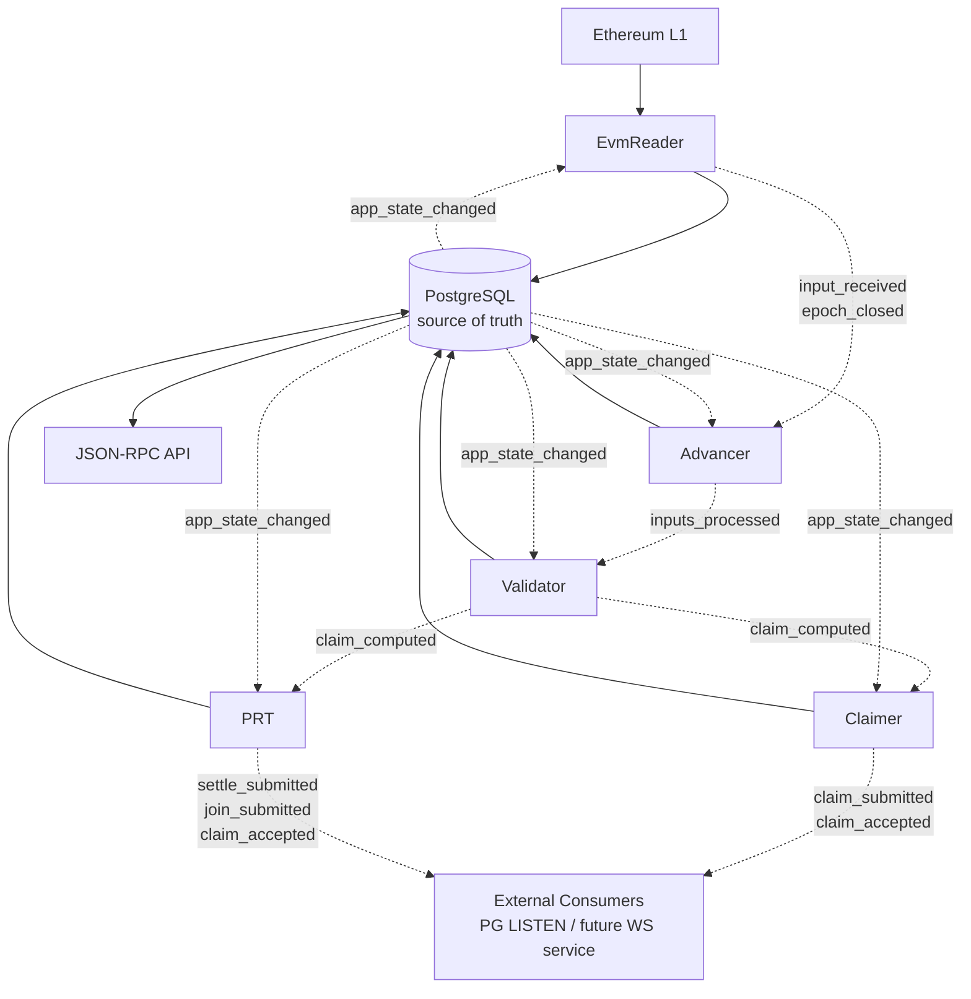
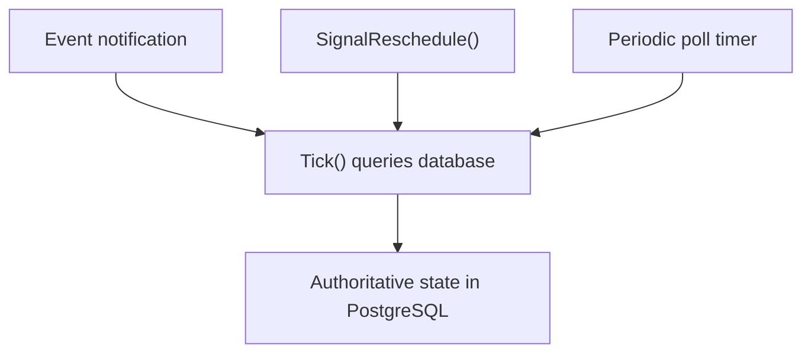
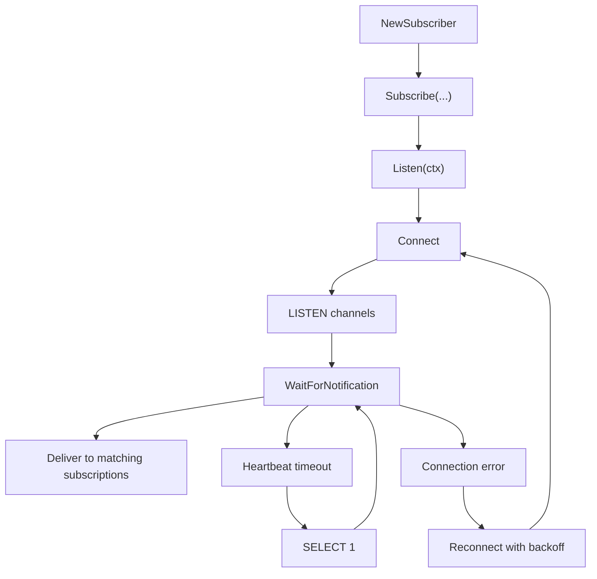
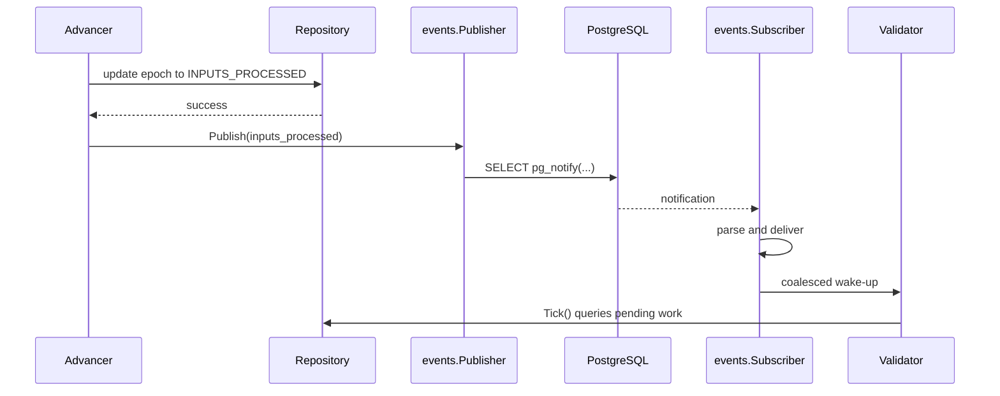
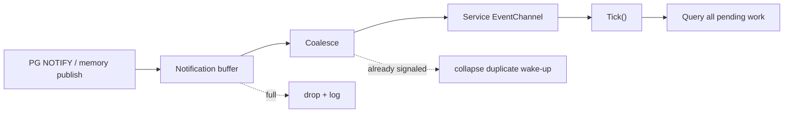

# `internal/events`

`internal/events` is the rollups-node event library. It adds advisory, low-latency signaling on top of the existing database-driven coordination model.

The key rule is simple: events are hints, not commands. A notification tells a service that something probably changed and that it should re-query PostgreSQL. The database remains the only source of truth. If a notification is lost, duplicated, delayed, or injected, the system may become slower, but it should not become incorrect.

## Why It Exists

Before this library, inter-service coordination relied on fixed-interval polling. That works, but it adds avoidable latency and unnecessary database load during idle periods.

The event library keeps the same correctness model while improving timeliness:

- fast path: wake services immediately when upstream work is committed
- safety net: keep periodic polling so work is still discovered when notifications fail
- deployment flexibility: support both PostgreSQL `LISTEN/NOTIFY` and an in-memory bus
- operational simplicity: add no external infrastructure beyond PostgreSQL

## Objectives

The library is designed to:

- reduce end-to-end handoff latency between services under normal operation
- reduce idle polling pressure on PostgreSQL
- preserve identical correctness semantics in standalone and multi-process modes
- keep producers decoupled from slow or offline consumers
- support external consumers of selected notification channels

It is explicitly not designed to provide:

- guaranteed delivery
- durable event persistence or replay
- total ordering across channels
- event sourcing
- a second source of truth alongside the database

## Architecture Summary

The event system sits beside the database workflow, not in front of it.



Solid edges are authoritative reads and writes. Dashed edges are advisory notifications.

## Package Layout

```text
internal/events/
    events.go
    publisher.go
    subscriber.go
    subscriptions.go
    coalesce.go
    postgres/
        publisher.go
        subscriber.go
        wire.go
    memory/
        bus.go
    trace/
        trace.go
    eventstest/
        recorder.go
        helpers.go
        contract_suite.go
        property_suite.go
```

### Main Responsibilities

| Package/File | Responsibility |
|---|---|
| `events.go` | Core types: `Channel`, `Notification`, validation helpers |
| `publisher.go` | `Publisher` interface and `NopPublisher` |
| `subscriber.go` | `Subscriber`, `SubscriptionFilter` |
| `subscriptions.go` | Channel groups for each service and external-only channels |
| `coalesce.go` | Collapse many notifications into one wake-up signal |
| `postgres/` | PostgreSQL `pg_notify`, `LISTEN`, reconnect, heartbeat, helper wiring |
| `memory/` | In-process pub/sub backend with matching fire-and-forget semantics |
| `trace/` | TLA+ trace recording for validation |
| `eventstest/` | Contract tests and helpers shared across backends |

## Event Model

Each notification carries only enough information to scope a database query:

```go
type Notification struct {
    Channel       Channel `json:"ch"`
    ApplicationID int64   `json:"app_id"`
    EpochIndex    uint64  `json:"epoch_idx"`
}
```

The payload is intentionally small. Consumers do not trust it as authoritative state. They use it to decide which database query to run next.

### Channels

The library currently defines nine channels:

| Channel | Producer | Consumer |
|---|---|---|
| `input_received` | EvmReader | Advancer |
| `epoch_closed` | EvmReader | Advancer |
| `inputs_processed` | Advancer | Validator |
| `claim_computed` | Validator | Claimer, PRT |
| `claim_submitted` | Claimer | external consumers |
| `claim_accepted` | Claimer, PRT | external consumers |
| `settle_submitted` | PRT | external consumers |
| `join_submitted` | PRT | external consumers |
| `app_state_changed` | services and/or DB-side lifecycle logic | all services |

The external-only channels are also exposed in code as `events.ExternalNotificationChannels`.

Service-specific subscription groups are available via:

- `events.EVMReaderChannels()`
- `events.AdvancerChannels()`
- `events.ValidatorChannels()`
- `events.ClaimerChannels()`
- `events.PRTChannels()`

## Core API

### Publisher

```go
type Publisher interface {
    Publish(ctx context.Context, n Notification)
}
```

`Publish` does not return an error by design. Producers have already committed the real state change to the database. A failed notification should not force them into rollback or retry logic that would blur the boundary between advisory signaling and authoritative persistence.

### Subscriber

```go
type Subscriber interface {
    Subscribe(channels ...Channel) <-chan Notification
    SubscribeWithFilter(filter SubscriptionFilter, channels ...Channel) <-chan Notification
    Listen(ctx context.Context) error
    Close() error
}
```

This is a two-phase API:

1. call `Subscribe` during service setup to obtain delivery channels
2. call `Listen` during service execution to run the backend listener

`SubscribeWithFilter` provides application-level filtering after parsing and before channel delivery. PostgreSQL still filters only by channel name; app ID filtering happens in-process.

### Coalescing

The common consumption pattern is:

1. subscribe to notifications
2. call `events.Coalesce()` on the notification channel
3. pass the resulting `<-chan struct{}` into `pkg/service.Service.EventChannel`

That gives the service a single wake-up signal even if many notifications arrive in a burst.

## Hybrid Execution Model

Each service effectively runs with four layers:



- event notification: cross-service wake-up
- `SignalReschedule()`: in-process self-continuation when a service already knows more work remains
- periodic poll timer: unconditional safety net
- database query: the real decision point

This is the library's main correctness argument: all wake-up paths converge on the same `Tick()` logic and the same database queries.

## PostgreSQL Backend

The PostgreSQL backend is implemented under `internal/events/postgres`.

### Publish Path

The publisher marshals the `Notification` to JSON and executes:

```sql
SELECT pg_notify($1, $2)
```

Important properties:

- the NOTIFY is issued after the database write succeeds
- the publish path is fire-and-forget
- the publisher uses the shared `pgxpool.Pool`
- publish attempts are bounded by a short timeout
- failures are logged and dropped

This introduces a small atomicity gap between "state committed" and "notification sent". The design accepts that gap because the polling fallback closes it.

### Listen Path

The subscriber uses a dedicated `pgx.Conn`, not a pooled connection, because `LISTEN` is session state.

It provides:

- one or more `LISTEN` registrations issued in a single exec
- a bounded notification buffer
- non-blocking delivery to subscribers
- automatic reconnect with exponential backoff and jitter
- a heartbeat based on `WaitForNotification` timeout plus `SELECT 1`
- TCP keepalive support through the dialer
- optional readiness signaling through `SubscriberConfig.ReadySignal`

### Subscriber Lifecycle



### Why a Separate Events Connection Matters

`LISTEN/NOTIFY` requires session semantics. PgBouncer transaction pooling is therefore not suitable for the subscriber connection. The node supports a separate events connection string via `CARTESI_DATABASE_EVENTS_CONNECTION`; when unset, it falls back to `CARTESI_DATABASE_CONNECTION`.

## In-Memory Backend

The in-memory backend lives in `internal/events/memory`.

It implements both `Publisher` and `Subscriber` and is used for:

- standalone single-process execution
- tests that do not need a real PostgreSQL listener

It intentionally preserves the same high-level semantics as the PostgreSQL backend:

- `Publish` never blocks
- full buffers drop notifications
- `Listen` waits until context cancellation
- `Close` closes subscriber channels

What it does not provide is cross-process delivery. It only propagates events inside the current process.

`memory.Bus` also exposes `SetLogger(*slog.Logger)` for optional debug logging of publish and delivery activity.

## How Services Use It

At the integration boundary, services do not process event payloads directly in most cases. They use notifications to wake the existing `Serve()` loop early.

### Common Pattern

```go
import (
    "github.com/cartesi/rollups-node/internal/events"
    eventspg "github.com/cartesi/rollups-node/internal/events/postgres"
)

func wireEvents(
    ctx context.Context,
    pool *pgxpool.Pool,
    mainConnStr string,
    eventsConnStr string,
    logger *slog.Logger,
) *eventspg.WireResult {
    w := eventspg.Wire(
        pool,
        mainConnStr,
        eventsConnStr,
        logger,
        events.AdvancerChannels()...,
    )
    w.StartListener(ctx)
    return w
}
```

The resulting `WireResult` provides:

- `Publisher` for outbound notifications
- `Subscriber` for lifecycle management
- `Signal` as a coalesced wake-up channel for `pkg/service.Service`

When the caller owns the subscriber lifecycle, it should still close it:

```go
defer w.Subscriber.Close()
```

### Service Framework Hook

`pkg/service.Service` supports both event-driven wake-up and self-reschedule:

- `CreateInfo.EventChannel`
- `CreateInfo.EnableReschedule`
- `Service.SignalReschedule()`

That lets a service react to:

- work produced by other services
- more work discovered locally in the same pipeline stage
- the unconditional poll timer

### Current Channel Mapping

| Service | Subscribes To | Publishes |
|---|---|---|
| EvmReader | `app_state_changed` | `input_received`, `epoch_closed` |
| Advancer | `input_received`, `epoch_closed`, `app_state_changed` | `inputs_processed` |
| Validator | `inputs_processed`, `app_state_changed` | `claim_computed` |
| Claimer | `claim_computed`, `app_state_changed` | `claim_submitted`, `claim_accepted` |
| PRT | `claim_computed`, `app_state_changed` | `claim_accepted`, `settle_submitted`, `join_submitted` |

The Claimer and PRT do not subscribe to their own external notification channels. They use `SignalReschedule()` for self-continuation instead.

## End-to-End Flow



## Backpressure and Delivery Semantics

The library is deliberately built to avoid blocking producers.



This has several consequences:

- duplicate events are acceptable
- dropped events are acceptable
- bursty event streams are acceptable
- slow consumers do not backpressure producers

This works only because `Tick()` queries the database for all pending work, not just the exact item described by the event.

## Operational Characteristics

### Logging

The system emits structured logs for:

- successful publish and receive at debug level
- event-triggered and timer-triggered ticks at debug level
- listener connection and reconnection at info/warn levels
- marshal, unmarshal, and delivery failures at warn/debug levels

`CARTESI_LOG_LEVEL_EVENTS` can be used to give event-related logging its own level in the node.

### Configuration Knobs

| Knob | Meaning |
|---|---|
| `SubscriberConfig.HeartbeatTimeout` | how long `WaitForNotification` can sit idle before a heartbeat probe |
| `SubscriberConfig.BufferSize` | notification channel capacity before drops |
| `SubscriberConfig.ReadySignal` | test synchronization hook for subscriber readiness |
| `CARTESI_DATABASE_EVENTS_CONNECTION` | optional separate LISTEN connection string |
| `CARTESI_FEATURE_EVENTS_MEMORY_BUS` | use in-memory backend in standalone mode |
| `CARTESI_LOG_LEVEL_EVENTS` | separate event log level |

## Advantages

- lower handoff latency without changing service ownership boundaries
- lower idle polling overhead
- no new infrastructure beyond PostgreSQL
- same programming model in standalone and multi-process modes
- explicit separation between notification transport and authoritative state
- external monitoring hooks through selected channels

## Tradeoffs and Limitations

The library improves latency, not correctness. That design choice brings real limits:

| Topic | Implication |
|---|---|
| Delivery guarantee | notifications are at-most-once and may be lost |
| Durability | NOTIFY payloads are not persisted and are not replayed |
| Atomicity | there is a small post-commit, pre-publish failure window |
| Ordering | cross-channel global ordering is not guaranteed |
| Replication | LISTEN/NOTIFY is not WAL-replicated; listeners must reach the primary |
| Pooling | transaction-pooled PgBouncer is incompatible with the subscriber connection |
| Payload size | PostgreSQL NOTIFY payloads are limited to about 8 KB |
| Scope | memory backend does not cross process boundaries |

## Failure Model

The intended failure behavior is:

- if the subscriber connection dies, it reconnects and re-issues all `LISTEN` commands
- if PostgreSQL restarts, notifications in flight are lost, but the next poll still catches committed work
- if a consumer is offline when an event is published, startup sync catches up
- if a notification payload is malformed, it is logged and ignored
- if a consumer is slow, notifications may be dropped, but coalescing plus full DB scans preserve progress
- if an attacker injects notifications, consumers still validate real work against the database

The most important guarantee is unchanged: committed work remains discoverable through polling even when the event path is unhealthy.

## Testing and Verification

The library ships with dedicated testing support:

- `eventstest.ContractSuite` verifies semantic equivalence across backends
- `eventstest.Recorder` captures published notifications in tests
- `eventstest.helpers` provides wait/drain helpers for channel assertions
- `eventstest.PropertySuite` exercises transport-dependent properties
- `trace.Recorder` records traces for validation against the TLA+ model

This matters because the library's promise is behavioral, not just structural: different backends must behave the same way at the API boundary.

## Design Rules to Keep

If this library is extended, these constraints are load-bearing:

- the database must remain authoritative
- producers must never block on notification delivery
- services must continue to run periodic catch-up queries
- event-triggered work and timer-triggered work must converge on the same `Tick()` logic
- external-consumer channels should be treated as stable contracts once exposed

If any of those rules change, the library stops being a latency optimization and starts becoming part of the correctness path. That would require a different design.
